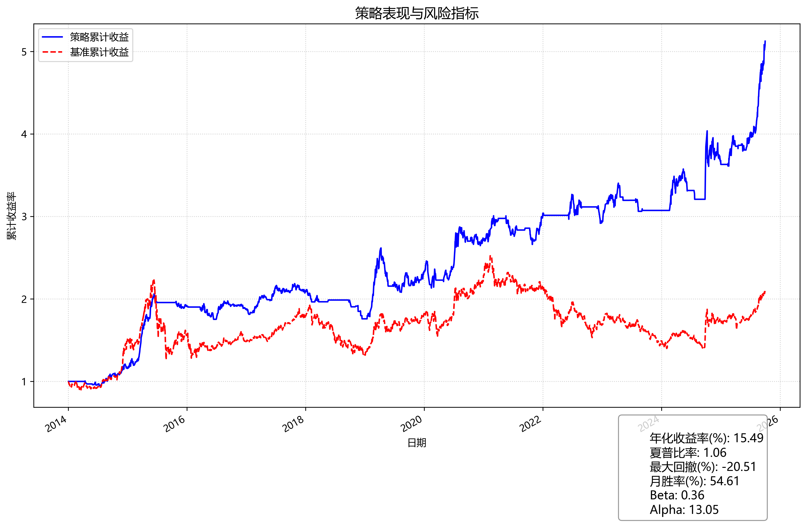

# 癌(A)股财务指标低频策略

## 开始

1. 开通迅投账户，接入数据源。或，将pandas数据(https://drive.google.com/drive/folders/1G32FcP5TwkNlYw5rUgYjCDJQwY4uHieq?usp=drive_link)下载到./downloaded
2. python run.py

## 简述
- 财务指标
    - 扣非净利润连续增长
    - 杠杆率<70%
    - 剔除上市前财报
    - ROE>10
    - 预测两年后PE作为排序基准

- 技术卖点
    - 20日均线

- 空仓条件
    - 沪深300的60日均线向下，且当日收盘低于60日均线